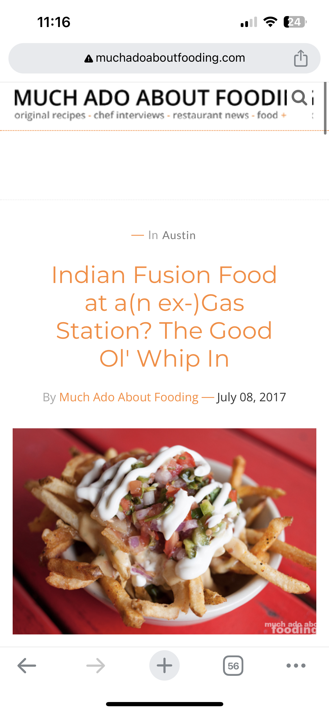
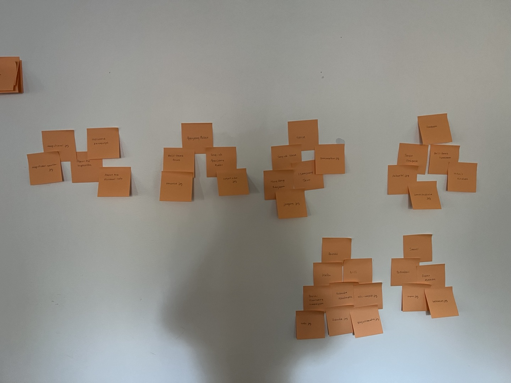

# Project 1: Design Journey

**For each milestone, complete only the sections that are labeled with that milestone.** Refine all sections before the final submission.

You are graded on your design process. If you later need to update your plan, **do not delete the original plan, leave it in place and append your new plan _below_ the original.** Then explain why you are changing your plan. Any time you update your plan, you're documenting your design process!

**Replace ALL _TODOs_ with your work.** (There should be no TODOs in the final submission.)

Be clear and concise in your writing. Bullets points are encouraged.

**Everything, including images, must be visible in _Markdown: Open Preview_.** If it's not visible in the Markdown preview, then we can't grade it. We also can't give you partial credit either. **Please make sure your design journey should is easy to read for the grader;** in Markdown preview the question _and_ answer should have a blank line between them.

## Markdown Instructions

## Personal Site (Milestone 1)

### Website Topic (Milestone 1)
> Briefly explain what your website will be about. Share your vision of your personal website.
>
My website will introduce a variety of accessible, reasonably-priced popular restaurants and dessert places in Seoul, South Korea that are more well-known among local citizens rather than tourists.

> Edit:
>
My website will introduce my favorite restaurants and dessert places that are accessible and reasonably-priced in Seoul, South Korea.

## Personal Website Design Exploration (Milestone 1)

Identify three personal websites (preferably static websites) that exist today on the web. You will be drawing inspiration from these sites for your own site; please select websites that are similar to the website you wish to create.

Include a screenshot of the home page for each site. If you're planning a mobile website, your screenshots should be from a mobile website. If you're planning a desktop website, your screenshots should be from a desktop website.

**We'll refer to these are your "example websites."**

1. <https://pinchofyum.com/>

    

2. <https://andershusa.com/>

    

3. <http://www.muchadoaboutfooding.com/>

    

### Personal Website 1 Review (Milestone 1)
> Review the personal website you identified above. (1-2 paragraphs)
>
> - Who do you think this site is designed for? Who is its intended audience?
> - What **goals** do you think the audience likely has when visiting this site.
> - What **content** is included?
> - Do you believe the content likely **addresses** the goals of the site's audience?
> - What do you like about the design?
> - Is the site designed for desktop, mobile, or desktop and mobile devices?
>
The site seems to be designed for beginner cooks or people who want simple food recipes that they can easily make at home. The audience is likely to be looking for easy, sustainable recipes based on the type of cuisine they're looking for and food preferences (vegan, allergens, etc).

The website contains a collection of creative meal recipes that can be cooked at home. The recipes can be viewed based on meal categories, time of meal, courses (appetizers, desserts, etc), ingredients, and many other selections. It displays images of the cooked meals as well. The content is likely to effectively address the audience's goals as there are multiple recipes categorized in various ways that should help the audience to navigate the recipe that fits best in their situation. I think this website is well designed in that users can easily see all of the recipes in one page, or choose to view them by category in another--and the multiple ways the recipes are categorized are all listed in one page so that it is easy for the user to determine what works best for their choosing. The site is designed for both desktop and mobile devices.

### Personal Website 2 Review (Milestone 1)
> Review the personal website you identified above. (1-2 paragraphs)
>
> - Who do you think this site is designed for? Who is its intended audience?
> - What **goals** do you think the audience likely has when visiting this site.
> - What **content** is included?
> - Do you believe the content likely **addresses** the goals of the site's audience?
> - What do you like about the design?
> - Is the site designed for desktop, mobile, or desktop and mobile devices?
>
This website is designed to introduce restaurants to try in various countries/cities around the world. Its intended audience is likely to be tourists traveling to foreign countries or a city that is unfamiliar to them. It is likely that the audience for this website intends to find a list of popular restaurants in the country/city they are traveling to, as well as a guide or a map that specifies their location and the pricing of the food.

The website contains food reviews of famous restaurants, city guides that specify a list of restaurants as well as detailed information about them and their locations, articles regarding the latest updates on food in global cities, and images that show the restaurants or the menus they provide. The content is likely to address the goals of the audience because it shows detailed information of what sorts of food are available and popular in diverse cities, as well as providing reviews and location information. I like how the site is emphasizing images so that it's easy to see as first sight what the food looks like. The site is designed for both desktop and mobile devices.

### Personal Website 3 Review (Milestone 1)
> Review the personal website you identified above. (1-2 paragraphs)
>
> - Who do you think this site is designed for? Who is its intended audience?
> - What **goals** do you think the audience likely has when visiting this site.
> - What **content** is included?
> - Do you believe the content likely **addresses** the goals of the site's audience?
> - What do you like about the design?
> - Is the site designed for desktop, mobile, or desktop and mobile devices?
>
The site is designed to introduce original recipes and restaurants recommendations with different cuisines in various locations. Its intended audience is likely be beginner cooks, people searching for homemade recipes, or people searching for new restaurants to try. The audience most likely has goals to find convenient locations for new restaurants to try visiting, as well as detailed recipes that they can follow step-by-step.

The content includes images of finished recipes, hit menus of the introduced restaurants, the location information of the restaurants, articles containing interviews with cooks, and recipes for food, all categorized into the type of meal. The content is likely to address the goals of the site's audience because it provides a wide range of information that people searching for recipes or restaurants will want to know, but perhaps the surplus of information may make the process a bit confusing. I like how the content is organized with large images representative of the content, as well as a brief preview text. The site is designed for both desktop and mobile devices.

## Audience & Goals (Milestone 1)

Using what you learned from studying the example websites, identify your website's audience and their goals.

### Audience (Milestone 1)
> Briefly explain who the intended audience is for your website. Be specific and justify why this audience is appropriate for your site's topic.
>
My intended audience is tourists visiting Seoul, South Korea, ranging from students to parents traveling with their children. I believe I could specifically target tourists that aren't traveling with a tour guide, and are attempting to make their own travel plans. This audience is appropriate because my site will be providing mostly local restaurants in Seoul (of which I am familiar with), categorized by district, which will be reasonably priced for people similar to me and my family (student, 3-person household).

### Audience Goals (Milestone 1)
> Why would your audience visit your site?
> Identify at least 3 goals that your users have for visiting your website.
>
1. To find restaurants that are verified by locals in Seoul without connections with a tour guide.

2. To find restaurants at convienient locations depending on their travel plans.

3. To find restaurants of which prices fit within their expected spendings.

## Content Planning (Milestone 1)

Plan your site's content.

### Your Site's Planned Content (Milestone 1)
> List **all** the content you plan to include your personal website.
> You should list all types of content you planned to include (i.e. text, photos, images, etc.)
>
- Categorization of restaurants by districts in Seoul (text)
- Categorization of restaurants by cuisine (text)
- Descriptions of restaurants (name, location, pricing, cuisine, menus etc) (text)
- Map of Seoul that color codes districts (image)
- Photographs of signature menus of the restaurants (image, photo)
- "About Me" page (text)
- Website logo (image)

### Content Justification (Milestone 1)
> Explain (about a paragraph) why this content is the right content for your site's audience and how the content addresses their goals.
>
First of all, tourists need to know approximately where each restaurant is located, so a categorization of the restaurants by district, along with a widescale map depicting Seoul and approximate restaurant location will be convienient for the audience. Also, tourists will not be familiar with the transportation or the routes to reach a certain location, precise location information with supplemental guides describing how to arrive the area from a more-famous landmark or subway station will make their travels easier. More specific descriptions of restaurants with the type of cuisine and photos to visualize the signature meals will help the audience to determine if the restaurant is appealing to them, and the pricing information will let them decide if it fits in their monetary plans.

### Home Page Content (Milestone 1)
> What is the content that your users would expect when visiting your site for the first time.
>
> Briefly identify what content you will include on the homepage and why this content should be the first thing your target audience sees when they visit your site.
>
Users would expect to see a page with options of how to navigate the restaurants they want to visit. I will first include a navigation bar that allows users to easily flip through pages. I will include two options to navigate through categories that consist of a list of 1. districts in Seoul and 2. cuisine types, and a image that shows the entirety of Seoul divided into districts. This will give the audience a clear guide of which strategy to choose when searching for the restaurants they want to visit, as well as an overview of the city they will be visiting.

## Information Architecture (Milestone 2)

For milestone 2, you will design the information architecture for all the pages your website.

You may change your homepage content based on your card sorting. If you do change the homepage content, don't update it above, just include the new plan in the section below (Content Organization).

### Content Organization (Milestone 2)
> Document your **iterations** of card sorting here. You must have at least 2 iterations of card sorting.
> Include photographic evidence of each iteration of card sorting **and** description of your thought process for each iteration.
> Please physically sort cards; please don't try and do this digitally.

1. All categories

   
    I first sorted the content into the most basic categories that each card fell into--introductory text, images, types of cuisines, the different districts, and the restaurants (and their detailed information, though I did not mark all of the information on the cards). I did this to examine how intuitive each piece of content would be without being associated to another content in another category. This iteration helped me to notice that the different content would not pose much meaning to a user if they are not connected to other types of content that are relevant.

2. By district

   
   I then sorted by separating the introductory text (supposedly the content of the welcome page) with the detailed content of restaurants and the images of their menus. I sorted the restaurants/dishes by the district each restaurant is located in. In this iteration, the different cuisines aren't shown--they are laid separately. This iteration is a visualization of creating a separate page for each district.

3. By cuisine

   
   After the previous iteration, I re-did the sorting through a similar process, except this time the restaurants are sorted by the type of cuisine they specialize in. This iteration visualizes creating separate pages for each cuisine. District information is laid separately.

4. Combining cuisine-district

   
   I thought that if I create separate pages for cuisine and district, there will be far too many pages for the user to navigate, which is not an effective design strategy. So I decided to make 2 large pages that will show a list of categorized restaurants--one big page for restaurants by district, and another for restaurants by cuisine. The photo shows the example of navigating to the restaurant-by-cuisine page (how the restaurants will be categorized in that one page), while the restaurant-by-district page will be separate.

5. Welcome/About Me

   
   I then decided to separate the welcome page and the "about me" page that will contain personal information about myself and the inspiration behind creating this website. The Welcome Page has more information that the user actually needs to figure out what the website is meant to do, and the supplemental information that will help them to use the site (the maps)

### Final Content Organization (Milestone 2)
> Which iteration of card sorting will you use for your website?

I will use the 4th and 5th iterations (they can essentially be combined into one because they show different areas of the website).

> Explain how the final organization of content is appropriate for your site's audiences.

The audience can most conveniently view the content without having to navigate to an enormous number of pages. This iteration decreases the number of pages from over 10 to just 4 in order to view the same content in a more organized manner. Because it will be easier for audiences to compare different restaurants in one place, combining the categorized information into a smaller number of pages will make it easier for them to get the information they want.

### Navigation (Milestone 2)
> Please list the pages you will include in your website's navigation.

- Home
- About Me
- By Cuisine
- By District

> Explain why the names of these pages make sense for your site's audience.

I originally thought the Home page should be called "Welcome", but then I remembered that I'm not necessarily welcoming the audience to a certain organization, I'm just showing them what my favorite eateries are! So I settled on a more generic name.
"About Me" will indicate to the audience that the website was created by a single individual rather than a company (and these are already available on the Internet!), and make the interaction feel more personal.
"By Cuisine" and "By District" are just intuitive names that tell the audience how the restaurants will be categorized, so that they can choose how they want to compare the different eateries.

## Visual Themes (Milestone 3)

**Make the case for your decisions using concepts from class, as well as other design principles, theories, examples, and cases from outside of class.**

Remember to focus on the things we can't see just by looking at the site: changes, alternatives considered, processes, and justifications.

Each section is probably around 1 reasonably sized paragraph (2-4 sentences).

### Theme Ideas (Milestone 3)
> Discuss several (more than two) ideas about styling your site's theme. Explain why the theme ideas are appropriate for your target audiences.

TODO: theme ideas

### Final Theme (Milestone 3)
> Which theme did you select as your final theme? Why?

TODO: what theme will your website use?

### Theme Rationale (Milestone 3)
> Discuss your final theme design: how do they fit your overall design goals and audiences?

TODO: theme rationale

> Emotion is a big part of design. What emotions were you thinking about or trying to convey in your designs?

TODO: theme emotions

## Composition (Final Submission)

### Home Page Composition (Final Submission)
> Include at least two sketches of possible composition ideas for the home page.
> Provide an explanation for each sketch explaining the idea.
> Show your design process.
> **Use the example websites above as inspiration for your site's design.**

TODO: composition sketches

### Final Site Design (Final Submission)
> Include a sketch of the final composition for each page in your site.
> Provide an explanation below each sketch.

TODO: site sketches

### Static Website Design Check (Final Submission)
> We're building a static website without interactivity.
> **No part of your website may dynamically change.**
> Examples of dynamic behavior are dropdown menus, hamburger menus, popups, modals/lightboxes, image carousels, etc.
>dfd
> Audit your design and check that you aren't relying on any dynamic features.

TODO: Explain why your site's design is completely static.

## Rationale (Final Submission)

**This rationale should be polished writing:** one you might submit as a report to a client or boss to help explain the project and convince them you did a good job. You'll be surprised how much writing and communicating you need to do about projects and choices on internships and jobs; practice that here.

It should be a comprehensive, complete story of the project. You might find that each section runs a few paragraphs (1-2). Sketches can often help tell the story of your design. Screenshots are also useful for describing issues discovered during the design process and how you addressed them.

**All images must be visible in "Markdown: Open Preview" for credit!**

Your rationale should be a polished version of the earlier explanations.

### Audience (Final Submission)
> A complete and polished description of the intended audience(s) for your website.

TODO: audience rationale

### Design Goals (Final Submission)
> An explanation of the design goals for that audience, based on your earlier rationales.

TODO: your design goals

### Content Organization & Navigation (Final Submission)
> An explanation of how the final content organization and navigation met your goals and why it's appropriate for your audience.

TODO: content and information architecture rationale

### Visual Design (Final Submission)
> An explanation of how the final design met your goals and why it's appropriate for your audience.

TODO: design rationale

### Self-Reflection (Final Submission)
> Take some time here to reflect on how much you've learned since you started this class. It's often easy to ignore our own progress. Take a moment and think about your accomplishments in this class. Hopefully you'll recognize that you've accomplished a lot and that you should be very proud of those accomplishments!

TODO: reflection

## Grading (Final Submission)

### Grading: Open the Design Journey in Markdown: Open Preview (Final Submission)
> Preview your design journey in VS Code. Please verify that this document is easy to read/grade.
>
> - Remove all _TODOs_
> - All images must be visible.
> - All images must be oriented the correct way.
> - There should be a blank line between the question prompt and your answer.
>
> Is your design journey easy to read?

TODO: design journey ready to grade?

### Collaborators
> List any persons you collaborated with on this project.

TODO: list your collaborators

### Resources
> Please cite any external resources you used in the creation of your project.

TODO: list resources
